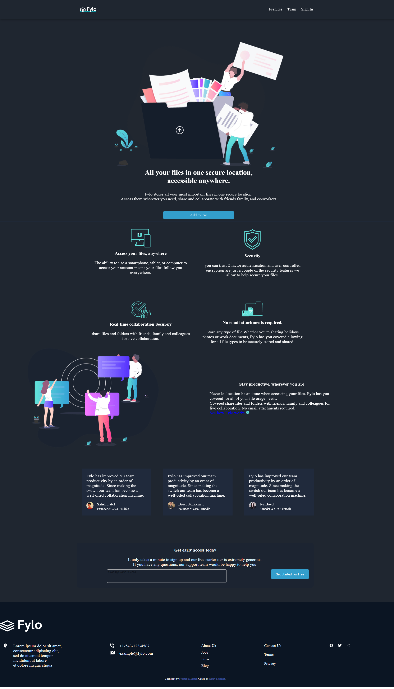
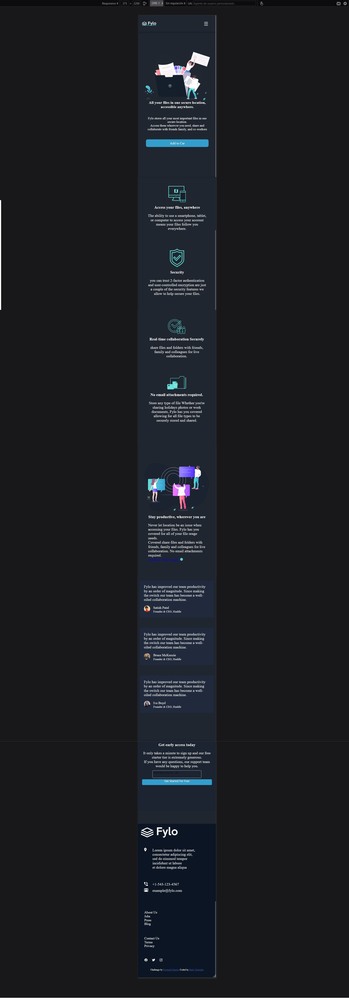

# Frontend Mentor - Fylo dark theme landing page solution

This is a solution to the [Fylo dark theme landing page challenge on Frontend Mentor](https://www.frontendmentor.io/challenges/fylo-dark-theme-landing-page-5ca5f2d21e82137ec91a50fd). Frontend Mentor challenges help you improve your coding skills by building realistic projects. 

## Table of contents

- [Overview](#overview)
  - [The challenge](#the-challenge)
  - [Screenshot](#screenshot)
  - [Links](#links)
- [My process](#my-process)
  - [Built with](#built-with)
  - [What I learned](#what-i-learned)
  - [Continued development](#continued-development)
  - [Useful resources](#useful-resources)
- [Author](#author)
- [Acknowledgments](#acknowledgments)

## Overview
This is a solution to the [Fylo dark theme landing page challenge on Frontend Mentor](https://www.frontendmentor.io/challenges/fylo-dark-theme-landing-page-5ca5f2d21e82137ec91a50fd). Frontend Mentor challenges help you improve your coding skills by building realistic projects. 
### The challenge

Users should be able to:

- View the optimal layout for the site depending on their device's screen size
- See hover states for all interactive elements on the page

### Screenshot




### Links

- Solution URL: [Add solution URL here](https://your-solution-url.com)
- Live Site URL: [Add live site URL here](https://your-live-site-url.com)

## My process

### Built with

- Semantic HTML5 markup
- CSS custom properties
- CSS Grid
- Mobile-first workflow

### What I learned

This project is one of many projects that [Frontend Mentor](https://www.frontendmentor.io) offers free to anyone who wants to learn how to code and design websites. I suppose that for great code developers and/or for experienced programmers, these types of challenges are very simple, but the truth is that I have realized that working only with html and css (basic knowledge) is something that everyone who wants to become a good developer must master.

With the practical method of the Frontend Mentor challenges (something similar to clone style) I have learned not to forget the basics and not only in programming, in all kinds of knowledge that is acquired.

I learned to design a responsive card with classes named by me (and others by renowned libraries) which shows me that by learning programming languages correctly, we can make computers transmit anything we want to express to the whole world.

```html
<h1>Some HTML code I'm proud of</h1>
```
```css
.proud-of-this-css {
  color: papayawhip;
}
```
```js
const proudOfThisFunc = () => {
  console.log('🎉')
}
```

### Continued development

Undoubtedly, css style sheets and their rules are something that if you don't use them often, over time it is somewhat difficult to remember their benefits, for this reason css is something that I will always try to develop or program according to the needs of each project. Avoiding using libraries that although they offer structured content and facilitate optimal experiences for users, I think that for someone who is learning they only hinder learning.

The next thing to learn will be to modify the html elements and style them but with javascript

### Useful resources

- [W3-Schools](https://www.w3schools.com/ - De los primeros curso en línea que realicé. los recomiendo para quienes están empenzando y para mantener como referencia en estapas avanzadas del aprendizaje.
- [Developer.mozila-CSS_Grid_Layout](https://developer.mozilla.org/es/docs/Web/CSS/CSS_Grid_Layout) - No sé tú pero para mi estos devs son unos cracks y con su sección Tecnología para el desarrollo web' pude darle solucion al reto de [Frontend Mentor](https://www.frontendmentor.io).
- [Bootstrap] (https://getbootstrap.com/) Creo que no hay nada mejor que trbajar con la librería que estos masters en desarrollo han creado y mantienen al día con actualizaciones cada vez más sorprendentes.

## Author

- Website - [herby-afro - GitHub](https://github.com/herby-afro)
- Frontend Mentor - [@herby-afro](https://www.frontendmentor.io/profile/herby-afro)
- Twitter - [@Estriplet3](https://www.twitter.com/Estriplet3)


## Acknowledgments
Developer initiatives that motivate new students with free online programs are welcome. Personally, I thank [Frontend Mentor](https://www.frontendmentor.io) for the ease with which they have provided their challenges to anyone who wants to learn and/or improve their design and programming skills.
The main reason why I have decided to stop copying and pasting other people's code to see how websites are made is that I have decided to take seriously this fascinating career that is software development and programming.
My next step is to get into the online school of [Microverse](https://apply.microverse.org/) The learning and job placement opportunities are good and to get in but above all to finish satisfactorily with the plan of studies, I will be closer to my goal.

So Thank you and may the code be on your side